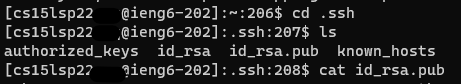
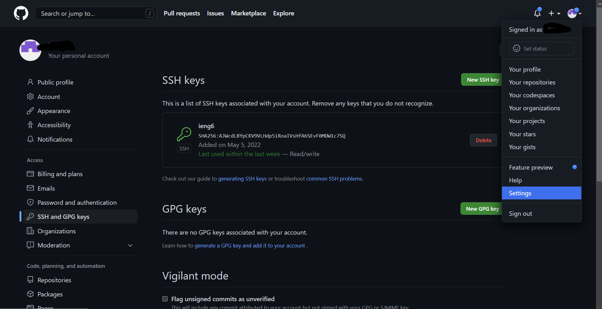
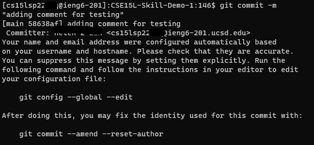
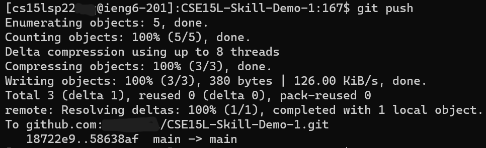

# Lab Report 3: More Things with SSH

## Streamline SSH Configuration
### Create Your Alias
1. Open the file or create a file located at `~/.ssh` called config.
2. Add the lines
   ```
   Host ieng6
    HostName ieng6.ucsd.edu
    User cs15lsp22zzz (use your username)
   ```
   
   * If this doesn't work try adding a line explicityly refering to your id_rsa file
      ```
      Host ieng6
         HostName ieng6.ucsd.edu
         User cs15lsp22zzz (use your username)
         IdentityFile ~/.ssh/id_rsa
      ```
3. The entry tells SSH what username to use (value in User) when logging into specific servers (HostName) and gives the server nicknames (Host)
4. To log on type `ssh [nickname you chose]`
   * In this case `ssh ieng6`
   

* Now you can use `ieng6` in commands now instead.
   * For example copying a file to the server
      * Template: `scp [file to copy] [nickname]:[location to copy to]`
      * `scp .\testScpWithAlias.txt ieng6:~/testScpWithAlias.txt`

   

---
## Set Up Github Access from ieng6
This section will allow you to complete actions like git push from the command line. Demo would be done using the ieng6 server


### Instruction
1. First connect to the ieng6 remote server
2. Use `ssh-keygen` to create the keys.
   * Use the default setting of `ssh-keygen` (id_rsa, other version might have problems with the ieng6). Simply press enter when prompted for file to save the key (unless you want to save the key elsewhere) and for a passphrase.
3. Go to where the public key is saved
   * If you used the default then it'll be in the .ssh folder
4. Use `cat id_rsa.pub` or the relevant file name or other commands to get the contents of the public key. <br>
   
5. Go to [Github](github.com) and in the uppr right corner of any page, click the profile photo. Then click **Settings**.
6. On the left find and click **SSH and GPG keys** 
7. Using the **New SSH Key** button, create a name for the key and in the "Key" field paste the public key that was copied.


### Demo
Now if you run the command `git push` it should work and here is the resulting [git commit](https://github.com/Miyuki-L/CSE15L-Skill-Demo-1/commit/58638af45770887390b0d3848f4e04cef0a42bf9).



---

## Copy Whole Directories with `scp -r`
When you are scp-ing a small group of files(your scenario) you need to make sure that the target directory exists in remote. If you are scp-ing the entire folder then the folder is automatically created if it does not exist already.